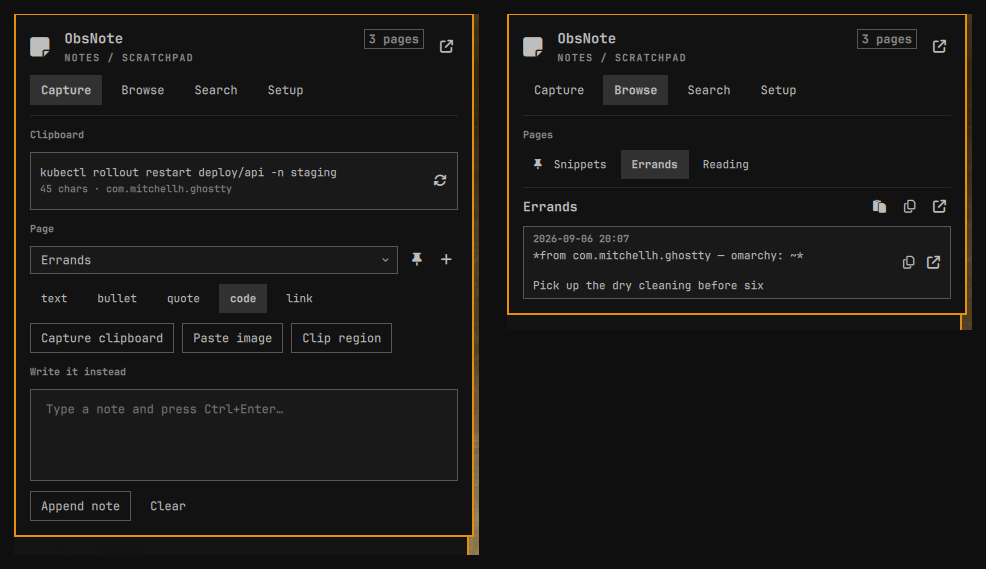

# ObsNote

**Capture into Obsidian from the Omarchy bar.** Clipboard text, a pasted image,
a dragged screen region, or a note you type — one click and it is a timestamped
entry in a markdown page in your vault.

The other Obsidian plugins in the marketplace read your vault: they search it,
open notes, switch between them. ObsNote writes to it. It is the OneNote quick
note, on Linux: a scratchpad you paste into from anywhere, where a page is a
category.

**Obsidian never has to be running.** ObsNote writes markdown files directly,
and only launches Obsidian when you explicitly ask it to open a page.



## Capture

- **The clipboard, into a page you pick.** Text that looks like a command or
  code is fenced automatically, with the language guessed; a bare URL becomes a
  markdown link. Override the format per capture — `text`, `bullet`, `quote`,
  `code`, `link`.
- **A note you type**, straight in the panel. `Ctrl+Enter` appends it.
- **An image on the clipboard** — saved into the vault and embedded with
  `![[…]]`.
- **A screen region**, dragged. Region clips go through
  `omarchy-capture-region`, the same picker the first-party screenshot and
  screen-recording commands use, so the frozen screen, the window and monitor
  snapping, and the keyboard binds are identical to `SUPER + PrintScr`.
- **Without opening anything at all**: a global hotkey, a right-click on the bar
  icon, or `obsnote capture` from a script. Each one sends a notification and
  gets out of the way.

Every capture is stamped with the app and window title it came from, so a
snippet still means something a week later.

## And then get it back out

Capture is only half of a scratchpad — the other half is retrieving what you
threw in there.

- **Browse** a page's captures newest-first, and copy any one of them back to
  the clipboard. The copy strips ObsNote's own metadata line and unwraps the
  code fence, so what lands in your terminal is the command, not the markdown
  around it.
- **Search** every capture page full-text and copy straight from the results.
- **Open in Obsidian** when you actually want the editor — the panel deep-links
  to the exact page.

## Pages are categories

Create as many as you like and pin the ones you use most, so they sit at the top
of every picker. ObsNote keeps a folder note listing them all, can link that
folder note from an index page of your choosing, and can add the capture folder
to the vault's `.gitignore` if you would rather your scratch not land in git.
Each of those is a button you press — nothing is written outside the capture
folder without you asking.

## Install

```bash
omarchy plugin add https://github.com/tpelicano/omaobsnote --enable --yes
omarchy restart shell
```

Then click the bar icon and finish **Setup**: pick your vault (ObsNote reads
Obsidian's own vault list, so it is usually one click), name the capture folder
and the default page, and press **Create folder**.

### Removal

```bash
omarchy plugin remove tpelicano.obsnote
omarchy restart shell
```

`omarchy plugin remove` disables the widget (which drops it from your bar
layout) and deletes `~/.config/omarchy/plugins/tpelicano.obsnote`. It does
**not** touch anything else, so remove these yourself if you want them gone:

- `~/.local/state/omarchy/obsnote/state.json` — ObsNote's settings.
- Your capture folder inside the vault, and its `Attachments` subfolder — these
  are your notes, so nothing deletes them for you.
- The `<!-- obsnote:index:… -->` block in your index page, and the
  `/<folder>/` line in the vault's `.gitignore`, if you added them.
- Any Hyprland binding you added for quick capture.

## Dependencies

| Tool | What it buys | Without it |
|---|---|---|
| `wl-clipboard` (`wl-paste`, `wl-copy`) | Reading and writing the clipboard | **Required** — capture and copy-back do nothing |
| `hyprctl` | The app/window a capture came from | Captures still work, with no source line |
| `omarchy-capture-region` + `grim` | The "Clip region" button: frozen screen, window/monitor snapping | Falls back to bare `slurp`; freeform selection only, no freeze |
| `hyprpicker`, `jq` | Used by `omarchy-capture-region` for the freeze and the snap rectangles | The picker degrades on its own |
| `ripgrep` (`rg`) | Search | Falls back to `grep -rnI`; same results, slower on big folders |
| `jq` or `python3` | Only for `bin/obsnote read` / `search` / `path` | Those CLI subcommands refuse to run; the panel is unaffected |
| Obsidian | Opening a page from the panel | Everything else works; ObsNote reads and writes plain markdown |

All of these except Obsidian ship with a stock Omarchy install.

## The global hotkey

ObsNote does not edit your Hyprland config. The **Copy hotkey binding** button
in Setup puts this line on your clipboard:

```
bindd = SUPER SHIFT, N, ObsNote quick capture, exec, omarchy-shell obsnote quickCapture
```

Paste it into `~/.config/hypr/bindings.conf`. It captures the clipboard into
your default page and sends a notification, without opening the panel.

## Command line

`bin/obsnote` is a thin wrapper over the plugin's IPC surface, so a scripted
capture takes exactly the same code path as the panel button — same formatting,
same source stamp, same notification. Put it on your `PATH`:

```bash
ln -s ~/.config/omarchy/plugins/tpelicano.obsnote/bin/obsnote ~/.local/bin/obsnote
```

```bash
obsnote capture             # clipboard -> default page
obsnote capture Snippets    # clipboard -> a named page
obsnote note "call the plumber"
obsnote note -p Errands "pick up dry cleaning"
obsnote clip                # drag a region, embed the PNG
obsnote image               # clipboard image -> vault

obsnote pages               # list pages
obsnote read Snippets       # print a page
obsnote search deploy       # search every page
obsnote path Snippets       # the file on disk
obsnote folder              # the capture folder

obsnote open Snippets       # open in Obsidian
obsnote toggle              # the bar panel
obsnote status              # JSON: vault, folder, pages, outstanding setup
```

The read-only commands work straight off the vault on disk, so `obsnote read`
and `obsnote search` keep working when the shell is not running.

## IPC

Everything above is reachable directly:

```bash
omarchy-shell obsnote quickCapture
omarchy-shell obsnote captureTo Snippets
omarchy-shell obsnote noteTo Errands "pick up dry cleaning"
omarchy-shell obsnote clip
omarchy-shell obsnote pasteImage
omarchy-shell obsnote view search     # open straight onto a tab
omarchy-shell obsnote openPage Snippets
omarchy-shell obsnote pages
omarchy-shell obsnote status
omarchy-shell obsnote linkIndex       # refresh the index-page link
omarchy-shell obsnote syncFolder      # (re)create the folder + folder note
omarchy-shell obsnote ignoreInGit     # add the folder to the vault .gitignore
omarchy-shell obsnote toggle | open | close
```

## Keyboard

With the panel focused: `c` `b` `s` `g` switch to Capture / Browse / Search /
Setup, `v` captures the clipboard into the selected page, `r` clips a region,
`j`/`k` scroll, `Tab` moves to the next bar panel, `Esc` closes. In the Search
tab the query field takes focus automatically, so letters go to the field
instead. `Ctrl+Enter` in the note composer appends it.

## Bar widget settings

Hand-edited in `~/.config/omarchy/shell.json` under this widget's entry:

| Key | Values | Default |
|---|---|---|
| `barLabel` | `icon`, `text`, `icon+text` | `icon` |
| `labelText` | any string, shown when the label is not icon-only | `Notes` |
| `rightClickAction` | `quickCapture`, `clipRegion`, `openVault`, `none` | `quickCapture` |

Use `barLabel: "text"` if your Nerd Font subset lacks U+F249 (a sticky note).

## Where state lives

Everything ObsNote remembers — vault path, folder, default page, pinned pages,
recent searches, the capture toggles — is in

```
~/.local/state/omarchy/obsnote/state.json
```

It is watched, so editing it by hand takes effect immediately. Only the three
cosmetic bar settings above live in `shell.json`: the widget settings schema
has no list type, and a settings write-back replaces the whole layout entry, so
real configuration does not belong there.

## What it writes, and where

Inside the vault, ObsNote only ever writes:

- `<folder>/<Page>.md` — captures are **appended**, never rewritten, so an edit
  you make in Obsidian at the same moment cannot be lost.
- `<folder>/<Attachments>/obsnote-<timestamp>.png` — pasted and clipped images.
- `<folder>/<folder>.md` — the folder note. ObsNote regenerates only the list
  between its `<!-- obsnote:pages:… -->` markers; prose you add around it
  survives.
- Your index page and the vault `.gitignore` — **only** when you press the
  corresponding button, and again only inside its own marker block or as a
  single appended line.

Page names are sanitized to one path segment, so a page called `../../.ssh` is
a file called `-..-.ssh.md` inside the capture folder and nothing else.

## Development

```bash
make link      # symlink this repo into ~/.config/omarchy/plugins
make enable
make reload    # omarchy restart shell -- the only reliable way to apply a QML edit
make test      # node tests + omarchy plugin validate + qmllint
make unlink
```

All the logic lives in `Model.js`, a plain ES5 module with no QML types, so
`node --test` and the shell load the same file. The QML is UI and process
plumbing only.

## Licence

MIT. See [LICENSE](LICENSE).
